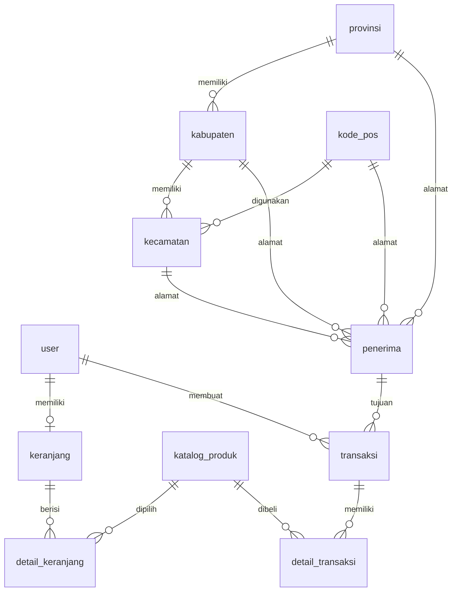

# Dokumentasi Database dan Integrasi SnackFlow

## Gambaran Database

Database SnackFlow menyimpan data user, produk, keranjang, transaksi, detail transaksi, penerima, wilayah pengiriman, dan data pembayaran.

Nama tabel utama:

- `user`
- `katalog_produk`
- `keranjang`
- `detail_keranjang`
- `transaksi`
- `detail_transaksi`
- `penerima`
- `kode_pos`
- `kecamatan`
- `kabupaten`
- `provinsi`

## Tabel User

Tabel `user` menyimpan data akun.

Kolom penting:

- `id`
- `nama_lengkap`
- `email`
- `password`
- `role`
- `no_telepon`
- `avatar`
- `kode_pos_id`
- `otp`
- `otp_expired_at`

Keterangan:

- `role` membedakan admin dan user.
- `avatar` menyimpan path file foto profil, bukan file gambar secara langsung.
- `otp` dan `otp_expired_at` dipakai untuk reset password.

## Tabel Katalog Produk

Tabel `katalog_produk` menyimpan data produk yang dijual.

Kolom penting:

- `id`
- `nama_produk`
- `kategori`
- `harga`
- `stok`
- `deskripsi`
- `foto_produk`
- `berat`

Keterangan:

- `foto_produk` menyimpan path gambar produk.
- `berat` digunakan untuk perhitungan ongkir RajaOngkir.
- `stok` dikurangi saat transaksi berhasil dibuat, bukan saat produk masuk keranjang.

## Tabel Keranjang

Tabel `keranjang` adalah header keranjang milik user.

Kolom penting:

- `id`
- `user_id`

Relasi:

- Satu user dapat memiliki satu keranjang aktif.
- Satu keranjang dapat memiliki banyak detail keranjang.

## Tabel Detail Keranjang

Tabel `detail_keranjang` menyimpan item produk dalam keranjang.

Kolom penting:

- `id`
- `keranjang_id`
- `produk_id`
- `jumlah_produk`

Keterangan:

- Item keranjang tidak mengurangi stok.
- Jika stok terbaru lebih kecil daripada jumlah di keranjang, item dapat dihapus otomatis oleh sistem.

## Tabel Transaksi

Tabel `transaksi` menyimpan data utama pesanan.

Kolom penting:

- `id`
- `user_id`
- `penerima_id`
- `tanggal_transaksi`
- `metode_pembayaran`
- `status_transaksi`
- `status_pembayaran`
- `catatan_admin`
- `resi`
- `ongkir`
- `midtrans_order_id`
- `snap_token`
- `snap_redirect_url`

Keterangan:

- `midtrans_order_id` digunakan sebagai identitas transaksi online di Midtrans.
- Transaksi offline memiliki `midtrans_order_id = null`.
- `resi` dibuat otomatis setelah pembayaran online berhasil atau diisi admin pada transaksi offline.
- `snap_token` dan `snap_redirect_url` digunakan untuk membuka pembayaran Midtrans.

## Tabel Detail Transaksi

Tabel `detail_transaksi` menyimpan rincian produk yang dibeli.

Kolom penting:

- `id`
- `transaksi_id`
- `produk_id`
- `jumlah_produk`
- `harga_produk`
- `subtotal_produk`

Keterangan:

- `harga_produk` menyimpan harga produk pada saat transaksi dibuat.
- `subtotal_produk` menyimpan hasil `harga_produk * jumlah_produk`.

## Tabel Penerima

Tabel `penerima` menyimpan data tujuan pengiriman.

Kolom penting:

- `id`
- `provinsi_id`
- `kabupaten_id`
- `kecamatan_id`
- `kode_pos_id`
- `nama_penerima`
- `no_telp_penerima`
- `detail_alamat`

Keterangan:

- Data penerima dipisahkan dari tabel transaksi agar struktur database lebih rapi.

## Tabel Wilayah

Tabel wilayah terdiri dari:

- `kode_pos`
- `provinsi`
- `kabupaten`
- `kecamatan`

Relasi:

- Provinsi memiliki banyak kabupaten.
- Kabupaten memiliki banyak kecamatan.
- Kecamatan dapat terhubung ke kode pos.
- Penerima dapat terhubung ke provinsi, kabupaten, kecamatan, dan kode pos.

## Status Transaksi

Status transaksi menjelaskan posisi pesanan.

- `Menunggu Konfirmasi`: transaksi baru dibuat dan menunggu keputusan admin.
- `Dikonfirmasi`: admin menyetujui pesanan dan user dapat membayar.
- `Diproses`: pembayaran berhasil dan pesanan sedang diproses.
- `Dibatalkan`: pesanan dibatalkan admin atau pembayaran gagal/kedaluwarsa.
- `Selesai`: pesanan diterima user.

## Status Pembayaran

Status pembayaran menjelaskan kondisi pembayaran.

- `pending`: pembayaran belum selesai.
- `paid`: pembayaran berhasil.
- `dibatalkan`: pembayaran dibatalkan, gagal, atau kedaluwarsa.

## Pembeda Transaksi Online dan Offline

Sistem membedakan transaksi online dan offline dari `midtrans_order_id`.

- Online: `midtrans_order_id` terisi.
- Offline: `midtrans_order_id` bernilai `null`.

Metode pembayaran tidak digunakan sebagai pembeda online/offline karena transaksi offline juga dapat menggunakan QRIS, COD, atau transfer bank.

## Integrasi RajaOngkir

RajaOngkir digunakan pada proses checkout.

Fungsi utama:

- Mencari tujuan pengiriman berdasarkan input user.
- Menghitung ongkir berdasarkan origin toko, tujuan, dan berat produk.

Endpoint yang dipakai di service:

- `/destination/domestic-destination`
- `/calculate/domestic-cost`

Aturan pengiriman:

- Kurir yang dipakai adalah JNE.
- Layanan yang dipakai adalah REG.
- Setelah alamat dipilih, ongkir dipasang otomatis.

## Integrasi Midtrans

Midtrans digunakan untuk pembayaran transaksi online.

Data penting yang dikirim ke Midtrans:

- `order_id`
- `gross_amount`
- `customer_details`
- `shipping_address`
- `item_details`
- `expiry`
- `enabled_payments`

Metode pembayaran yang diaktifkan:

- `gopay`

Catatan:

Pada mode sandbox Midtrans, pembayaran GoPay pada desktop dapat tampil dalam bentuk QR/QRIS simulator. Yang menjadi acuan sistem tetap status transaksi dari Midtrans, bukan hanya tampilan simulator.

## Webhook Midtrans

Webhook Midtrans diterima melalui:

```text
POST /midtrans/notification
```

Alur webhook:

1. Midtrans mengirim notification ke aplikasi.
2. Sistem membaca `order_id`.
3. Sistem mencari transaksi berdasarkan `midtrans_order_id`.
4. Sistem membaca `transaction_status`.
5. Sistem memperbarui status transaksi dan status pembayaran.

Mapping status:

- `capture`: `paid` dan `Diproses`.
- `settlement`: `paid` dan `Diproses`.
- `pending`: `pending` dan `Dikonfirmasi`.
- `deny`: `dibatalkan` dan `Dibatalkan`.
- `cancel`: `dibatalkan` dan `Dibatalkan`.
- `expire`: `dibatalkan` dan `Dibatalkan`.

## Mekanisme Jika Webhook Terlambat

Jika user sudah membayar tetapi status di aplikasi belum berubah, sistem masih dapat melakukan sinkronisasi manual melalui fitur cek status pembayaran.

Sinkronisasi manual menggunakan `midtrans_order_id` untuk meminta status terbaru langsung ke Midtrans.

## ERD Ringkas



